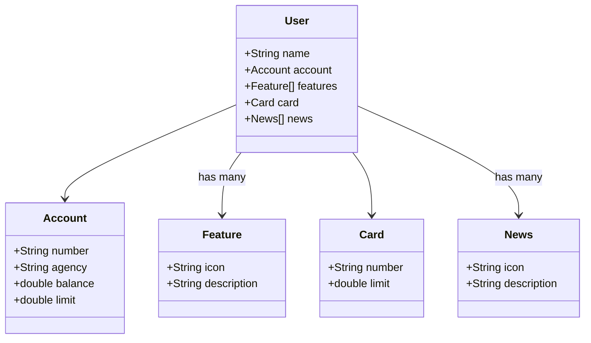

# Banco Digital - Estrutura de Classes

Este documento apresenta a estrutura de classes do sistema de banco digital, representada utilizando a sintaxe Mermaid. O objetivo é descrever a modelagem do usuário e seus principais componentes dentro do sistema.

## Diagrama de Classes

## Explicação das Classes

### User (Usuário)
A classe `User` representa um usuário do banco digital. Cada usuário possui:
- `name` (String): Nome do usuário.
- `account` (Account): Conta bancária vinculada ao usuário.
- `features` (Feature[]): Lista de funcionalidades disponíveis, como transações PIX, transferências, entre outras.
- `card` (Card): Cartão associado ao usuário.
- `news` (News[]): Notícias e atualizações do banco para o usuário.

### Account (Conta)
A classe `Account` representa a conta bancária do usuário, contendo:
- `number` (String): Número da conta.
- `agency` (String): Agência bancária.
- `balance` (double): Saldo disponível.
- `limit` (double): Limite de crédito disponível.

### Feature (Funcionalidades)
A classe `Feature` representa as funcionalidades relacionadas às transações bancárias, como PIX, transferências e pagamentos:
- `icon` (String): URL do ícone representando a funcionalidade.
- `description` (String): Descrição da funcionalidade, por exemplo, "Transferência via PIX".

### Card (Cartão)
A classe `Card` representa o cartão de crédito ou débito associado ao usuário:
- `number` (String): Número parcial do cartão, ocultando os primeiros dígitos para segurança.
- `limit` (double): Limite de crédito do cartão.

### News (Notícias)
A classe `News` representa atualizações e novidades do banco para os usuários:
- `icon` (String): URL do ícone representando a notícia.
- `description` (String): Descrição da notícia ou atualização.

## Conclusão
Este modelo define uma estrutura simples e funcional para representar usuários de um banco digital, permitindo a gestão de contas, transações, cartões e comunicação de atualizações importantes. O diagrama Mermaid ajuda a visualizar as relações entre as classes e seus atributos.

